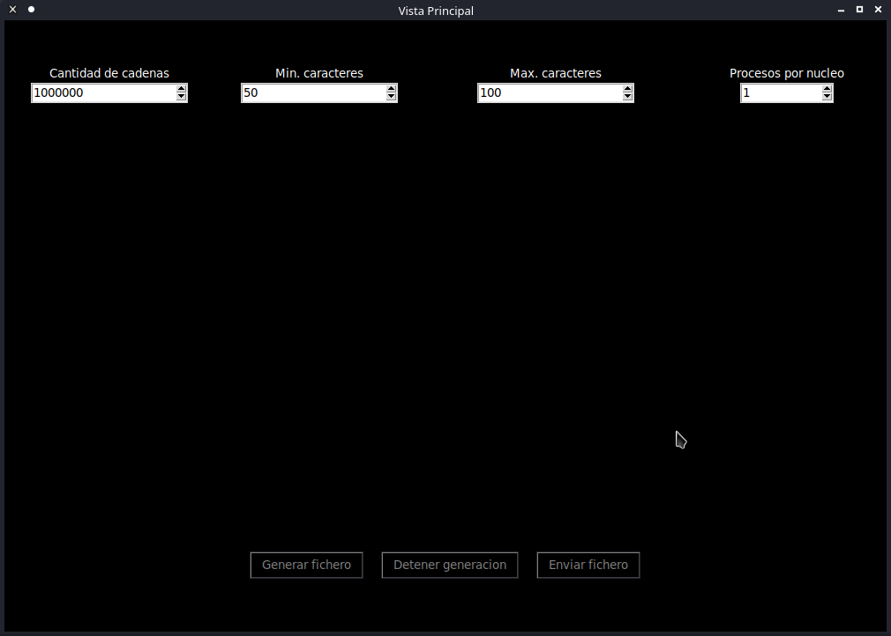

# 
Solucion propuesta

## Implementaciones necesarias

> ### ***`tools`***
Se definen funciones basicas para serializar, deserializar y enviar datos a traves de sockets

> ### ***`protocol`***

Se define el protocolo de comunicacion que seguiran tanto el cliente como el servidor para intercambiar datos entre ellos

> Caracteristicas:

 - `comunicacion estructurada`: Las clases ***`request`*** y ***`response`*** definen la forma en que se comunicaran ambos lados, brindando una estructura bien definida de estos objetos similar a la ***`JavaScript Object Notation(json)`***, usada mundialmente. Ambas brindan facil acceso a sus miembros a traves de la notacion 'punto' (***`request`***.***`header`***), donde ***`request`*** es una instancia de la clase ***`request`*** y ***`header`*** es un campo de dicha instancia. En caso de no existir el campo solicitado, el valor devuelto es ***`None`***.
 - `operaciones bien definidas`: Todas las operaciones permitidas entre cliente y servidor, se encuentran definidas de antemano dentro de la clase ***`ServerOperation`*** que hereda de ***`enum`***, creando asi una coleccion con todas las operaciones posibles.

## Cliente

### Interfaz visual

Se uso la libreria ***`tkinter`*** para una sencilla ventana como la que se muestra a continuacion

> ### Estructura
 - ***`configurable`***: Implementacion base para crear objetos facilmente configurables.
 - ***`core`***: Implementaciones de caracteristicas necesarias para la generacion de cadenas reglamentadas e interactuar con el ***`filesystem`***.
 - ***`visual`***: Todo lo relacionado con la interfaz visual del cliente, desde la clase ***`AppConfig`***, usada para configurar la aplicacion cliente, hasta la clase ***`MainView`*** que se encarga del visual y del proceso de generacion de cadenas. La clase ***`App`*** brinda una abstraccion extra para las ventanas del cliente y la inicializacion del cliente.

### Configuracion
La configuracion del cliente se realiza a traves del archivo ***`config.json`*** ubicado en la raiz del proyecto, el cual es leido al comienzo de la ejecucion y pasado como parametro de inicializacion a la aplicacion.

Los parametros configurables son:
 - ***`host`***: direccion del servidor al que enviara los datos.
 - ***`port`***: puerto de comunicacion entre ambas partes.
 - ***`pattern`***: patron que tendran las cadenas que se generaran, debe ser una cadena de texto que represente una expresion regular.
 - ***`min_chars`***: minima cantidad de caracteres permitidas en el control de entrada ***`Min. caracteres`***.
 - ***`max_chars`***: maxima cantidad de caracteres permitidas en el control de entrada ***`Max. caracteres`***.
 - ***`max_strings_by_process`***: maxima cantidad de caracteres que se generara por proceso durante la paralelizacion de la generacion de las cadenas.
 - ***`interface`***: subconfiguracion del aspecto visual del cliente.
    - ***`size`***: dimensiones de la ventana principal del cliente.
    - ***`input_bg`***: color de fondo que tendran las entradas de datos del cliente.
    - ***`input_fg`***: color de fuente que tendran las entradas de datos del cliente.
    - ***`window`***: subconfiguracion de la ventana principal del cliente; todas las opciones de configuracion de tkinter aplicables a este componente son validas.
    - ***`input_controls`***: subconfiguracion de los contenedores de los controles de entrada del cliente; todas las opciones de tkinter aplicables a este componente son validas.
    - ***`buttons_controls`***: subconfiguracion de los botones del cliente.
        - ***`container`***: subconfiguracion de los contenedores de los botones; todas las configuraciones de tkinter aplicables a este componente son validas.
        - ***`buttons`***: subconfiguracion de los botones; todas las configuraciones de tkinter aplicables a este componente son validas.

### Funcionamiento
Desde la interfaz visual del cliente se obtienen los siguientes valores:

 - ***`cantidad de cadenas`***: cantidad de cadenas que se generaran.
 - ***`Min. caracteres`*** y ***`Max. caracteres`***: minima y maxima cantidad de caracteres respectivamente, que tendran las cadenas que se generaran.
 - ***`procesos por nucleo`***: cantidad de procesos por cada nucleo, que seran usados durante la generacion de las cadenas para paralelizar dicho proceso.

Al presionar el boton ***`Generar fichero`***, se genera un fichero con las cadenas especificadas. Esto se hace en un proceso aparte para no congelar la interfaz visual. La generacion se hace de forma paralela de la siguiente forma:
 - `1`: se computan la cantidad de procesos necesarios para generar la cantidad especificada de cadenas
 - `2`: se ejecutan los procesos de forma iterativa en lotes de ***`procesos por nucleo`*** * ***`nucleos logicos`***
 - `3`: cada proceso al terminar, bloquea el acceso al fichero a generar para evitar condiciones de carrera, y escribe en este las cadenas que el genero; luego es cerrado el proceso.

Si en algun momento durante la generacion del fichero se presiona el boton de cierre de la aplicacion, se muestra un cuadro de dialogo para confirmar la orden, y en caso afirmativo, se detiene todo el proceso de generacion y se revierten los cambios realizados. Si se presiona el boton ***`Detener Generacion`***, simplemente se detiene la generacion del fichero y se revierten los cambios.

Cuando el boton ***`Enviar fichero`*** es presionado, se envia al servidor todo el contenido para su analisis, y se muestra un cuadro con el tiempo tomado por el servidor para analizar el fichero.

## Servidor

### Estructura
Se compone de dos componentes principales:
 - ***`server`***: una implementacion minimalista de un servidor ***`TCP`*** implementado con ***`sockets`*** al que se le pueden agregar componentes de servicios externos a la implementacion del servidor, los cuales manejaran las peticiones entrantes.
 - ***`service`***: una implementacion base de un servicio, y una implementacion funcional de un servicio (***`WordPonderationService`***), especializado en manejar las peticiones de parte del cliente anteriormente descrito.

### Configuracion
La configuracion, tanto del servidor como de cada uno de los servicios que se agregan al servidor, se encuentran en la raiz del proyecto. La configuracion del servidor se ubica en el archivo ***`config.json`***, mientras que el de cada servicio se encuentra en su correspondiente archivo ***`<service>Config.json`***, donde ***`<service>`*** es el nombre con el que fue agregado el servicio al servidor.

Los parametros configurables del servidor son:
 - ***`HOST`***: direccion donde se alojara el servidor.
 - ***`PORT`***: puerto por el que escuchara las peticiones.
 - ***`max_clients`***: maxima cantidad de clientes que el servidor escuchara al mismo tiempo.
 - ***`buffer_size`***: cantidad de bytes que podra leer el servidor del socket en un solo intento.

Los parametros configurables de cada servicio varia de un servicio a otro, en el caso de ***`WordPonderationService`***, estos son:
 - ***`special_pattern`***: patron que sera excluido de la funcion de ponderacion.
 - ***`special_value`***: valor que se le dara a aquellas cadenas que cumplan con el patron definido.
 - ***`full_match`***: define cuando el patron definido se aplicara a toda la cadena, o solamente a alguna seccion de esta.

En caso de que no se haya definido un archivo de configuracion para algun servicio, este funcionara con sus parametros predefinidos.

### Ponderacion
Similar a la generacion del fichero en el cliente, la ponderacion se realiza de forma paralela en distintos procesos, que se coordinan evitando condiciones de carrera sobre las palabras del fichero. Cada proceso analiza una parte de las palabras.